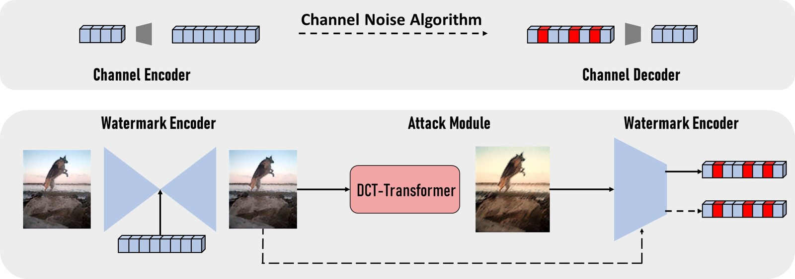

# Distortion-Agnostic-watermarking-based-on-DCT-Based-Transformer
Distortion Agnostic watermarking based on DCT-Based Transformer

## Dataset

Tiny COCO: https://drive.google.com/file/d/1Up-NoEUcfAlmdj2Rhg8fZrfdcyjGrTQ4/view?usp=sharing

## Result On Paper
https://docs.google.com/spreadsheets/d/1iB9iQ7p68j7MldXvhn7xEjoj2ajJLXeJtPSKtjqXa_I/edit?usp=sharing


<p align="center">

<br>
The overall architecture of our DCT-Transformer watermarking
</p>


## Single-GPU Command
```
train from scratch (not pretraining) ---> python train.py  --batch_size 32  --dataset /coco --pretrain_iter 0
train from scratch (pretraining)     ---> python train.py  --batch_size 32 --dataset /coco --pretrain_iter 5000
load pretrain checkpoint             ---> python train.py  --batch_size 32 --resume_pretrain /checkpoint/pretrain500.pyt
load train checkpoint                ---> python train.py  --batch_size 32 --resume /checkpoint/train500.pyt --> auto skip necst pretraining
```

## Multi-GPU Command
```
CUDA_VISIBLE_DEVICES=[rank of GPU] python -m torch.distributed.launch --nproc_per_node=[GPU size] torch_ddp_train.py --dataset /coco
```


